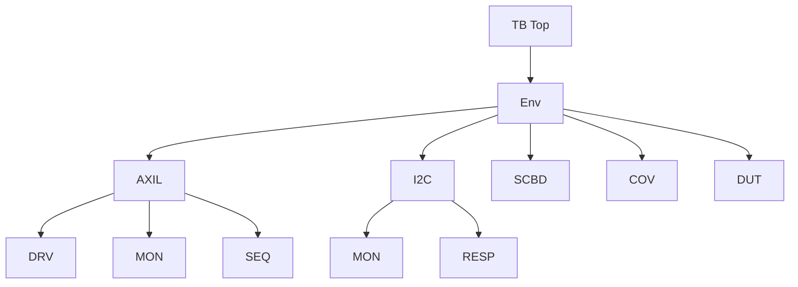
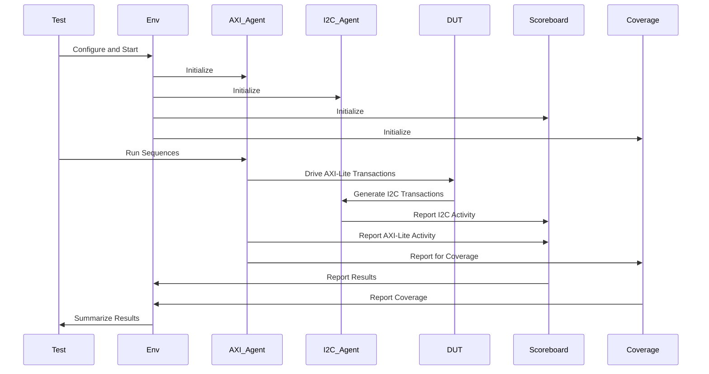

# AXI-Lite to I2C Master Bridge Verification Project

## Project Overview

This project implements a UVM-based verification environment for an AXI-Lite to I2C Master Bridge. The system under test (DUT) is an I2C master controller that can be configured and controlled via an AXI-Lite interface. The verification environment aims to thoroughly test the functionality, performance, and compliance of this bridge.

## Architecture Overview

## File Structure and Descriptions

### Top-Level Files

1. **axil_tb_top.sv**
   - This is the top-level testbench module.
   - It instantiates the DUT, interfaces, and manages the UVM test execution.
   - Responsible for clock generation, reset logic, and connecting the DUT to the verification environment.

2. **bridge_env.sv**
   - Defines the `bridge_env` class, which is the top-level environment.
   - Instantiates and connects all sub-components: AXI-Lite agent, I2C agent, scoreboard, and coverage collector.

### Package and Define Files

3. **dut_params_defines.svh**
   - Contains parameter definitions for the DUT configuration.
   - Includes settings for prescaler, FIFO depths, and other DUT-specific configurations.

4. **register_defines.svh**
   - Defines the register map for the I2C master controller.
   - Includes enum definitions for register addresses and bit-field structures.

5. **i2c_master_axil_pkg.sv**
   - Main package file that includes common definitions and imports for the entire project.

6. **axil_test_pkg.sv**
   - Package containing test-related classes and configurations.

7. **bridge_env_pkg.sv**
   - Package that encapsulates the environment setup and its components.

### Agent-Related Files

#### AXI-Lite Agent

8. **axil_seq_item.sv**
   - Defines the `axil_seq_item` class for AXI-Lite transactions.
   - Includes randomization constraints and utility functions for AXI-Lite operations.

9. **axil_driver.sv**
   - Implements the `axil_driver` class responsible for driving AXI-Lite transactions to the DUT.
   - Converts high-level sequence items into pin-level activity on the AXI-Lite interface.

10. **axil_monitor.sv**
    - Defines the `axil_monitor` class that observes and records AXI-Lite transactions.
    - Converts pin-level activity on the AXI-Lite interface into transaction objects.

11. **axil_agent_pkg.sv**
    - Package file that includes all AXI-Lite agent components.

#### I2C Agent

12. **i2c_trans.sv**
    - Defines the `i2c_trans` class for I2C transactions.
    - Includes fields for I2C address, data, and read/write operations.

13. **i2c_monitor.sv**
    - Implements the `i2c_monitor` class that observes I2C bus activity.
    - Converts I2C bus-level activity into transaction objects.

14. **i2c_responder.sv**
    - Defines the `i2c_responder` class that emulates an I2C slave device.
    - Responds to I2C transactions initiated by the DUT.

15. **i2c_agent_pkg.sv**
    - Package file that includes all I2C agent components.

### Sequence Files

16. **axil_seq_list.sv**
    - Package containing all sequence classes used in the project.

17. **api_single_rw_seq.sv**
    - Defines sequences for single register read/write operations via the AXI-Lite interface.

18. **memory_slave_seq.sv**
    - Implements sequences that simulate interactions with an I2C slave memory device.

19. **config_seq.sv**
    - Contains sequences for configuring the DUT via register writes.

20. **write_read_seq.sv**
    - Implements a sequence that performs a write followed by a read I2C transaction through the DUT.

### Verification Components

21. **scoreboard.sv**
    - Implements the `scoreboard` class for cross-checking between AXI-Lite commands and resulting I2C transactions.
    - Verifies the correctness of DUT operations by comparing expected and actual outcomes.

22. **axil_coverage.sv**
    - Defines the `axil_coverage` class for functional coverage collection.
    - Monitors AXI-Lite transactions and collects coverage on various aspects of the DUT's functionality.

### Test Files

23. **i2c_master_base_test.sv**
    - Defines the base test class with common setup and configuration for all tests.

24. **i2c_master_test.sv**
    - Extends the base test class with specific test scenarios and sequences.

### Interface Files

25. **axil_interface.sv**
    - Defines the SystemVerilog interface for AXI-Lite protocol.
    - Includes clocking blocks for driver and monitor.

## Component Interactions

## Detailed Component Explanations

### AXI-Lite Agent
The AXI-Lite agent is responsible for generating and monitoring AXI-Lite transactions. It consists of:
- **Driver**: Converts sequence items into pin-level activity on the AXI-Lite interface.
- **Monitor**: Observes AXI-Lite interface and creates transaction objects.
- **Sequencer**: Generates and controls the flow of sequence items to the driver.

### I2C Agent
The I2C agent simulates I2C bus activity and monitors the DUT's I2C operations. It includes:
- **Monitor**: Observes I2C bus activity and creates transaction objects.
- **Responder**: Emulates an I2C slave device, responding to the DUT's I2C transactions.

### Scoreboard
The scoreboard is crucial for verifying the correctness of the DUT's operations. It:
- Receives AXI-Lite transactions from the AXI-Lite monitor.
- Receives I2C transactions from the I2C monitor.
- Compares expected behavior (based on AXI-Lite commands) with actual I2C transactions.
- Reports any mismatches or unexpected behaviors.

### Coverage Collector
The coverage collector gathers functional coverage information to ensure thorough testing. It:
- Monitors AXI-Lite transactions.
- Tracks coverage of various DUT features, configurations, and corner cases.
- Provides coverage reports to guide the verification process.

## Test Execution Flow

1. The top-level testbench (`axil_tb_top`) initializes the simulation environment.
2. UVM phases are executed, starting with the build phase to construct the environment hierarchy.
3. The configured test class (e.g., `i2c_master_test`) is run, which sets up the initial DUT configuration.
4. Test sequences are executed, driving AXI-Lite transactions to the DUT.
5. The DUT processes these commands and generates I2C transactions.
6. Both AXI-Lite and I2C activities are monitored and sent to the scoreboard and coverage collector.
7. The scoreboard continuously checks for correct operation.
8. Coverage is collected throughout the test execution.
9. At the end of the test, results and coverage reports are generated.

## Conclusion

This verification environment provides a comprehensive setup for testing the AXI-Lite to I2C Master Bridge. By utilizing UVM methodology and advanced verification techniques, it ensures thorough testing of the DUT's functionality, performance, and compliance with protocol specifications.

## TODOs and Improvement Steps

While the current verification environment provides a solid foundation, there are several areas where it can be enhanced to increase its effectiveness and efficiency. Here are some TODOs and actionable steps for improvement:

### 1. Enhance Coverage Model
TODO: Expand the coverage model to ensure all aspects of the DUT are thoroughly tested.
Actionable Steps:
- Review the DUT specification and identify all possible configurations and operating modes.
- Implement cover groups for each register, focusing on key bit combinations.
- Add cross-coverage between different configuration settings and operations.
- Implement functional coverage for I2C protocol-specific scenarios (e.g., repeated starts, clock stretching).

### 2. Implement Constrained Random Testing
TODO: Develop more sophisticated constrained random tests to uncover corner cases.
Actionable Steps:
- Create new sequence classes with advanced constraints that target specific scenarios.
- Implement intelligent randomization that adapts based on coverage feedback.
- Develop a mechanism to automatically generate test cases based on coverage holes.

### 3. Add Protocol Checkers
TODO: Implement protocol checkers for both AXI-Lite and I2C interfaces.
Actionable Steps:
- Develop assertions to verify AXI-Lite protocol compliance in the monitor.
- Implement I2C protocol checking logic to ensure the DUT adheres to the I2C specification.
- Add checks for timing violations, illegal bus conditions, and protocol-specific errors.

### 4. Improve Error Injection and Recovery Testing
TODO: Enhance the testbench's ability to inject errors and verify DUT recovery.
Actionable Steps:
- Modify the I2C responder to simulate various error conditions (e.g., NACK, clock stretching, bus stuck conditions).
- Create sequences that deliberately cause error conditions on the AXI-Lite interface.
- Develop tests to verify the DUT's error handling and recovery mechanisms.

### 5. Implement Performance Metrics
TODO: Add mechanisms to measure and report on the DUT's performance.
Actionable Steps:
- Implement counters and timers in the scoreboard to track transaction latencies.
- Create a performance collector component to gather statistics on throughput, bus utilization, etc.
- Develop tests specifically designed to stress-test the DUT's performance limits.

### 6. Enhance Reusability and Configurability
TODO: Make the testbench more modular and easily configurable for different variations of the DUT.
Actionable Steps:
- Refactor the environment to use configuration objects for easy customization.
- Implement a factory override mechanism for easy replacement of components.
- Create a central test configuration file to control all aspects of the test environment.

### 7. Implement Regression Suite and Continuous Integration
TODO: Develop a comprehensive regression suite and integrate with CI/CD pipelines.
Actionable Steps:
- Create a set of regression tests covering all aspects of functionality.
- Implement a mechanism to randomly select and run tests from the regression suite.
- Set up automated nightly regression runs with result reporting.
- Integrate the verification environment with a CI/CD tool (e.g., Jenkins, GitLab CI).

### 8. Improve Documentation and Usability
TODO: Enhance documentation and add features to improve usability.
Actionable Steps:
- Add detailed comments to all classes and methods.
- Create a user guide with instructions on how to run tests and interpret results.
- Implement a debug mode with increased verbosity and wave dumping.
- Add a mechanism for easy back-door access to DUT registers for debug purposes.

### 9. Implement Code Coverage
TODO: Add code coverage to ensure all RTL paths are exercised.
Actionable Steps:
- Set up code coverage collection using appropriate tools (e.g., VCS, Questa, etc.).
- Develop a strategy to analyze and act on code coverage results.
- Create additional tests or modify constraints to target uncovered code.

### 10. Add Power-Aware Verification
TODO: Incorporate power-aware verification techniques.
Actionable Steps:
- Identify power domains and power states in the DUT.
- Implement checks to verify correct behavior during power state transitions.
- Create sequences to test low-power modes and wake-up scenarios.

By addressing these TODOs and following the actionable steps, you can significantly enhance the capability, reliability, and effectiveness of your UVM testbench for the AXI-Lite to I2C Master Bridge.
